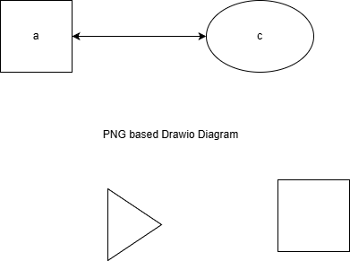

# PNG diagram

## Example

=== "Diagram"

The following is a PNG based drawio diagram:



You can open the diagram as an PNG in your browser. [Click here.](test.drawio.png)

=== "Markdown"

```markdown

```

