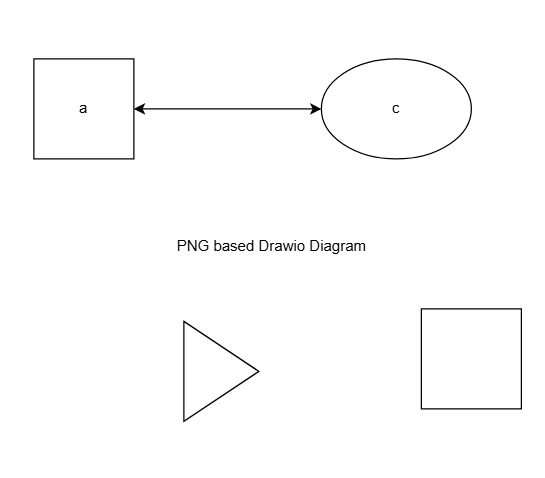

# PNG diagram

## Example

=== "Diagram"

The following is a PNG based drawio diagram:


You can open the diagram as an PNG in your browser. [Click here.](test.drawio.png)

If the PNG file contains no mxfile information, then it'll fail and fall back to displaying the PNG file:



With the following server warning:

```bash
WARNING -  Warning: PNG file 'missing-mxfile.drawio.png' on path '/tmp/mkdocs_avmpk9qy/tests/png' missing mxfile metadata
```

=== "Markdown"

```markdown

```